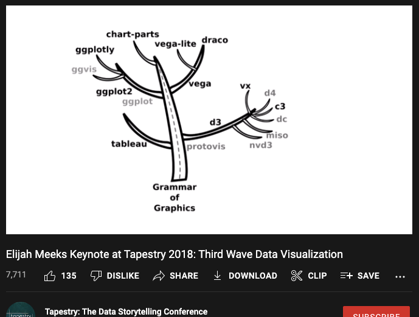

class: inverse, left, bottom
background-image: url(https://images.unsplash.com/photo-1543286386-713bdd548da4?ixlib=rb-1.2.1&ixid=MnwxMjA3fDB8MHxwaG90by1wYWdlfHx8fGVufDB8fHx8&auto=format&fit=crop&w=1470&q=80)
background-size: cover
# .Large[ma206data Lesson 3]
## .small[Data Wrangling and Tidyverse Tutorial]
#### .tiny[Dr. Evangeline Reynolds | 2022-08-18 |Image credit: William Iven, Upsplash]
???


---

# Warm-up

--

```{r}
pressure
```

---

### try out more geoms (more than one in a chart works)

- #### geom_point()
- #### geom_col() 
- #### geom_tile()

--

### use one of the pressure variables (temperature or pressure) instead of 'var_name' to explore a few more visual channels that can represent variables:

- #### aes(alpha = var_name)
- #### aes(fill = var_name) vs aes(color = var_name)

--

## Check how your neighbor is doing.


---

# Attendance question

--

## What's your favorite data viz/analysis tool up to this point? (pen and paper, excel?, something else?)

--

## 'Bonus': What company, w/ data viz production based on 'the grammar of graphics' was bought for 15.7 billion dollars. 


--

# Add myself...


---


# The "Grammar of Graphics" (1999)

```{r, out.width="40%", echo = F}
knitr::include_graphics("images/wilkinson_grammar_of_graphics.png")
```

---



Third wave data visualization, Meeks: https://www.youtube.com/watch?v=itChfcTx7aos

---


# A data visualization is made up of ...
--

### .left[... geometric objects ...]
--

### .center[...that take on aesthetics (color, line width, x-position) ...]
--

### .center[...which represent variables ...]
--

### .right[...from a dataset (dataframe)]


---

## Elements of the Grammar of Graphics (choices)
```{r, echo = F}
knitr::include_graphics("images/wilkinson_layers_grammar_of_graphics.png")
```

---


```{r setup, include = F}
# This is the recommended set up for flipbooks
# you might think about setting cache to TRUE as you gain practice --- building flipbooks from scratch can be time consuming
knitr::opts_chunk$set(fig.width = 6, fig.height = 4, message = F, warning = FALSE, comment = "", cache = T, dpi = 300)

options(tibble.print_min = 55)
options(knitr.duplicate.label = "allow")
options(width=300) # prevents data wrapping

ggplot2::theme_set(ggplot2::theme_gray(15))
```


```{css, eval = TRUE, echo = FALSE}
.remark-code{line-height: 1.5; font-size: 70%}

@media print {
  .has-continuation {
    display: block;
  }
}

code.r.hljs.remark-code{
  position: relative;
  overflow-x: hidden;
}


code.r.hljs.remark-code:hover{
  overflow-x:visible;
  width: 500px;
  border-style: solid;
}
```


```{r, include=FALSE}
knitr::opts_chunk$set(echo = TRUE)
```


---


| function |	action |
| --- | --- |
| filter() |	keep rows (if true) |
| select() |	keep variables (or drop them -var) |
| mutate() |	create a new variable |
| case_when() |	is used for “recoding” variable, often  used with mutate() |
| rename()	| renaming variables |
| arrange()	| order rows based on a variable |
| slice()	| *keep or drop rows based on row number |


---


```{r wrangle, include = T, out.width="80%", echo = F}
library(gapminder)
library(tidyverse)
gapminder %>% 
  filter(year == 2002) %>% 
  filter(continent == "Europe") %>% 
  select(-lifeExp) %>% 
  rename(population = pop) %>% 
  mutate(gdp_billions = 
           gdpPercap * population /
           1000000000) %>% 
  arrange(gdp_billions) %>% 
  mutate(country = 
           fct_reorder(country,
                       gdp_billions)) ->
europe_2002

ggplot(data = europe_2002) + 
  aes(x = gdp_billions) + 
  aes(y = country) + 
  geom_col() + 
  labs(y = NULL) + 
  labs(x = "US$ Billions") +
  labs(title = "Country GDP in Europe, 2002") + 
  labs(subtitle = "Source: gapminder package") + 
  labs(caption = "Dr. Reynolds for MA206") + 
  theme_minimal(base_size = 10)
```

---
class: inverse, center, middle

# What manipulation is required?


---

```{r}
# Original, full dataset
library(gapminder)
gapminder %>% 
  filter(continent == "Europe")

```


---

`r flipbookr::chunk_reveal("wrangle", display_type = "output")`

---

`r flipbookr::chunk_reveal("wrangle")`

---

# pressure and cars only

--

# Getting other data

- # gapminder
- # wages
- # ma206 data


---


# 1. install 'gapminder'
--


# 2. install 'remotes'
--

# 3. install 'Lahman' (baseball statistics back to 1800's!)
--


# 4. in console `remotes::install_github("EvaMaeRey/ma206data")`


---
class: inverse, center, middle

# Facets, Small multiples


---

`r flipbookr::chunk_reveal("hans")`

```{r hans, include = F}
library(tidyverse)
gapminder::gapminder %>% 
  filter(year == 2002) %>% 
  ggplot() + 
  aes(x = gdpPercap) + 
  aes(y = lifeExp) + 
  geom_point() + 
  aes(color = continent) + 
  aes(size = pop/1000000) + 
  labs(size = "Population\n(millions)") + 
  labs(color = NULL) + 
  labs(x = "Per Capita GDP ($US)") + 
  labs(y = "Life expecancy (years)") + 
  labs(title = "Life expectancy vs Per Capita GDP, 2002") + 
  labs(subtitle = "Data Source: gapminder package") + 
  labs(caption = "Produced for MA206 in Fall AY2023") + 
  facet_wrap(~ continent)
```


```{css, eval = TRUE, echo = FALSE}
.remark-code{line-height: 1.5; font-size: 100%}

@media print {
  .has-continuation {
    display: block;
  }
}

code.r.hljs.remark-code{
  position: relative;
  overflow-x: hidden;
}


code.r.hljs.remark-code:hover{
  overflow-x:visible;
  width: 500px;
  border-style: solid;
}
```


