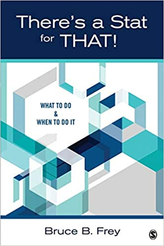

class: inverse, left, bottom
background-image: url(https://images.unsplash.com/photo-1543286386-713bdd548da4?ixlib=rb-1.2.1&ixid=MnwxMjA3fDB8MHxwaG90by1wYWdlfHx8fGVufDB8fHx8&auto=format&fit=crop&w=1470&q=80)
background-size: cover
# .Large[ma206data Lesson 4]
## .small[Statistic, Simulate, Strength; course project prep]
#### .tiny[Dr. Evangeline Reynolds | 2022-08-18 |Image credit: William Iven, Upsplash]
???


```{css, eval = TRUE, echo = FALSE}
.remark-code{line-height: 1.5; font-size: 70%}

@media print {
  .has-continuation {
    display: block;
  }
}

code.r.hljs.remark-code{
  position: relative;
  overflow-x: hidden;
}


code.r.hljs.remark-code:hover{
  overflow-x:visible;
  width: 500px;
  border-style: solid;
}
```


```{r, include=FALSE}
knitr::opts_chunk$set(echo = TRUE)
library(flipbookr)
```

---

# Warm up.  

--

## guessthecorrelation.com


---

# Course Map

- 6 step method
- SSS method; and theory based
- Correlation
- Course Project

--

# Course project proposal

- Due beginning of lesson 7
- Recommended 4 slides for submission


---

# Simulation based approach advocates

http://allendowney.blogspot.com/2016/06/there-is-still-only-one-test.html


---

<iframe width="320" height="266" src="https://www.youtube.com/embed/5Dnw46eC-0o" title="John Rauser keynote: "Statistics Without the Agonizing Pain" -- Strata + Hadoop 2014" frameborder="0" allow="accelerometer; autoplay; clipboard-write; encrypted-media; gyroscope; picture-in-picture" allowfullscreen></iframe>

---

<iframe width="320" height="266" src="https://www.youtube.com/embed/S41zQEshs5k" title="There's Only One Test" frameborder="0" allow="accelerometer; autoplay; clipboard-write; encrypted-media; gyroscope; picture-in-picture" allowfullscreen></iframe>


---
# Theory approach advocates elegant mathematical solutions...




---
class: inverse, center, middle

## Bonus opportunity #1: react to material

- ### tl;dr
- ### til

--

## Bonus opportunity #2

- ## 5 plots (10 points total)

### `remotes::install_github("EvaMaeRey/ma206data")`
### `remotes::install_github("EvaMaeRey/ggxmean")`


---


`r chunk_reveal("cars_scramble")`


---

`r chunk_reveal("cars_scramble", break_type = 50)`


```{r cars_scramble, include = F}
library(tidyverse)

cars %>% 
  ggplot() + 
  aes(x = speed) + 
  geom_rug(alpha = .25) + 
  aes(y = dist) + 
  ggsample::facet_scramble(n_facets = 1) + 
  geom_point() + 
  ggxmean:::geom_corrlabel()
```


---

```{r cars_scramble2, echo = F}
library(tidyverse)

cars %>% 
  ggplot() + 
  aes(x = speed) + 
  geom_rug(alpha = .25) + 
  aes(y = dist) + 
  ggsample::facet_scramble(n_facets = 12) + 
  geom_point() + 
  ggxmean:::geom_corrlabel() + 
  labs(title = "Correlation outcomes if within-trial (within row) relationship is scrambled")
```


```{css, eval = TRUE, echo = FALSE}
.remark-code{line-height: 1.5; font-size: 100%}

@media print {
  .has-continuation {
    display: block;
  }
}

code.r.hljs.remark-code{
  position: relative;
  overflow-x: hidden;
}


code.r.hljs.remark-code:hover{
  overflow-x:visible;
  width: 500px;
  border-style: solid;
}
```


